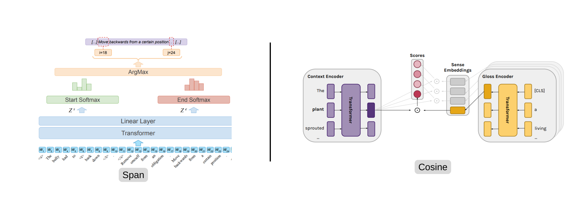

Copyright (c), [Barba](https://aclanthology.org/2021.naacl-main.371/) and [Blevins](https://aclanthology.org/2020.acl-main.95/).
# Dual Architecture pipeline for Word Sense Disambiguation (WSD)

This repository is a fork of [github.com/sayedshaun/wsd](https://github.com/sayedshaun/wsd) by **Sayed Shaun**, with the EC FAQ (Bengali) task added on top of the original SemCor/SemEval WSD pipeline; see [References](#references) for the citation.

This project implements algorithms and tools for Word Sense Disambiguation (WSD), the task of determining the correct meaning of a word (or, in the FAQ variant below, the correct answer to a question) based on its context. It provides datasets, evaluation scripts, and models to facilitate research and development in natural language processing applications where accurate sense/answer selection is essential.

`config.yaml` is currently set up for the **EC FAQ (Bengali)** task: given a user's Bengali question, pick the correct FAQ answer out of a handful of candidate answers, built from an internal FAQ tag set (see the pipeline below). The same code also supports the standard English **SemCor / SemEval** WSD benchmarks (`data_builder.DataBuilder`) — point `train_data_dir`/`val_data_dir` at a SemCor-style directory instead of a `.json` gold file to use that path.

## Project Structure
```
📁 ec-span-classifier
    ├── 📄 .gitignore
    ├── 📄 LICENSE
    ├── 📄 README.md
    ├── 📄 config.yaml           # EC FAQ config (default)
    ├── 📄 requirements.txt
    ├── 📄 download.sh
    ├── 📄 test_api.py           # temporary FastAPI service to try the checkpoint (/qa, /rank)
    ├── 📄 MODEL_USAGE.md        # how to load and score with the trained checkpoint elsewhere
    │
    ├── 🧠 Core Modules
    │   ├── 📄 model.py
    │   ├── 📄 predict.py
    │   ├── 📄 train.py
    │
    ├── 🧰 Utilities
    │   ├── 📄 train_utils.py
    │   ├── 📄 utils.py
    │   ├── 📄 wn_utils.py
    │
    ├── 📊 Data
    │   ├── 📄 dataset.py
    │   ├── 📄 data_builder.py
    │   ├── 📄 prepare_data.py            # CSV+tags -> prepared_data.json
    │   ├── 📄 convert_to_wsd_format.py   # prepared_data.json -> wsd_train_data.json
    │
    └── 📁 data
        ├── 📄 question_tag.csv          # question -> tag (gold labels)
        ├── 📄 tag_answer.json           # tag -> answer text
        ├── 📄 prepared_data.json        # + top_k similar-question candidates
        ├── 📄 wsd_train_data.json       # final gold dataset (sentence/sense_list/correct_sense)
        └── 📁 faq_wsd
            ├── 📄 train.json
            └── 📄 val.json
```
## Setup
This project requires `python=3.10`

```bash
pip install -r requirements.txt
```

## Training

```bash
python train.py -c config.yaml
```
with the following configuration:
```yaml
train_data_dir: data/faq_wsd/train.json  # Training data: a SemCor-style dir, or a .json gold file
val_data_dir: data/faq_wsd/val.json      # Validation data: a SemCor-style dir, or a .json gold file
model_name: csebuetnlp/banglabert        # Huggingface model name
output_dir: output                       # output directory to save checkpoints
num_sense: 3                             # Recommended 4/5; lower here to fit a small GPU (see below)
max_seq_len: 96                          # Between [1, 512]
batch_size: 4                            # Batch size for training
lr: 0.00002                              # Learning rate
weight_decay: 0.01                       # Weight decay for optimizer
epochs: 3                                # Number of epochs
logging_step: 400                        # After how many steps to log
precision: fp16                          # [fp16, fp32, bf16]
warmup_ratio: 0.1                        # After how many steps to warmup
grad_clip: 1.0                           # Gradient clipping factor
pos: ALL                                 # [ALL, NOUN, VERB, ADJ, ADV] (SemCor only)
device: cuda                             # [cpu, cuda]
seed: 42                                 # [int, none]
report_to: none                          # [wandb, none]
architecture: cosine                     # [span, cosine]
do_predict: false                        # predict after training (SemCor/SemEval only)
```
`num_sense`/`max_seq_len`/`batch_size` above are deliberately small — this checkpoint was trained on a 4GB-VRAM GPU, where `csebuetnlp/banglabert` (110M params, 32k vocab) already leaves little headroom once gradients and AdamW's optimizer state are accounted for. A larger vocab model like `google/muril-base-cased` (237M params, mostly its 197k-token embedding table) does not fit at all under 4GB, even at batch size 2. Raise these values if you have more VRAM to spare.

When `train_data_dir`/`val_data_dir` point at a `.json` gold file (as above) instead of a SemCor-style directory, `train.py` loads it directly via `data_builder.load_wsd_json` and skips the SemCor auto-download and the SemEval `predict.py` sweep. To switch back to the English SemCor/SemEval benchmarks, point both dirs at a SemCor-style directory (e.g. `data/Training_Corpora/SemCor`) and set `do_predict: true`.

## Evaluation
```bash
python predict.py \
    --data_dir "data/Evaluation_Datasets/semeval2015" \
    --model_name "distilbert-base-uncased" \
    --weight_dir "output/semeval2007" \
    --pos "ALL" \
    --seed 1234 \
    --num_sense 5 \
    --max_length 256 \
    --batch_size 32 \
    --architecture "cosine"
```


## EC FAQ Dataset (Bengali) — Build Pipeline

The FAQ variant re-purposes the same architectures (`cosine`/`span`) for a different task: given a user's Bengali question, pick the correct FAQ answer out of a handful of candidate answers. The gold dataset is built from two raw inputs and never depends on any model's own predictions for its labels:

- `data/question_tag.csv` — `question, tag` pairs (gold labels, one tag per question variation).
- `data/tag_answer.json` — `tag -> answer text` lookup.

### Build steps

**Inputs:** `data/question_tag.csv` (`question, tag`, gold labels) + `data/tag_answer.json` (`tag -> answer text`).

| Step | Script | What it does | Output |
|------|--------|---------------|--------|
| 1 | `prepare_data.py` | For every `(question, tag)` row, queries an embedding similarity API for the 10 most similar questions (each with its own tag + cosine score). | `data/prepared_data.json` |
| 2 | `convert_to_wsd_format.py` | Looks up the gold answer (`correct_sense = tag_answer[true_tag]`) and builds distractors (`sense_list`) from the unique answers of those 10 similar-question candidates. | `data/wsd_train_data.json` |
| 3 | one-off random split, seed=42 | 90/10 split of the gold file. | `data/faq_wsd/train.json`, `data/faq_wsd/val.json` |
| 4 | `python train.py -c config.yaml` | Tokenizes question + candidate answers, trains `WSDModel` (cosine architecture) to pick the correct answer's index. | model checkpoints in `output/` |

**Step 1 output shape** (`data/prepared_data.json`):
```json
{
  "question": "...",
  "true_tag": "...",
  "top_k_candidates": [{"question": "...", "tag": "...", "cosine_similarity": 0.98}],
  "right_candidate": {}, "index": 0
}
```
`true_tag` is gold, straight from the CSV. `right_candidate`/`index` just record whether the API happened to also return the gold tag — diagnostic only, unused downstream.

**Step 2 output shape** (`data/wsd_train_data.json`, and the `train.json`/`val.json` split of it):
```json
{"sentence": "...", "sense_list": ["...", "..."], "correct_sense": "..."}
```
`sense_list` holds up to 10 unique candidate answers (fewer if fewer exist — never padded). `correct_sense` is the gold answer; it's already inside `sense_list` for the vast majority of rows since the similarity API tends to also surface the true tag, but `dataset.py` guarantees it's added at train time even when it isn't.

**Step 4**: `dataset.py` trims `sense_list` to `num_sense` candidates (re-adding `correct_sense` if the trim dropped it), tokenizes the question and each candidate answer, and `model.py`'s `WSDModel` scores each candidate against the question via dot-product similarity, trained with cross-entropy against the correct index.

Key invariant: `true_tag`/`correct_sense` always comes from `question_tag.csv`/`tag_answer.json`. The similarity API only ever supplies the *distractor* candidates in `sense_list` — it has no influence on what the correct label is.

## Results (EC FAQ)

The current checkpoint (`output/step-12000-f1-0.9233.pt`) reaches **92.3% F1 on the internal validation split** (`data/faq_wsd/val.json`), and **87.3% correct-tag rate on a separate 7,406-turn production gold set** (`gold_eval.xlsx`, evaluated via `test_api.py`'s `/qa` endpoint against `ec-bot-eval-scripts/evaluation_script_qa.py`). Nearly all gold-set misses (93%) are cases where the correct answer was retrieved as a candidate but scored lower than a confusable sibling tag — see `MODEL_USAGE.md` for the detailed failure analysis and known-confusable tag pairs.

## Trying the checkpoint

`test_api.py` is a temporary FastAPI service for manually testing the trained checkpoint against real questions:

```bash
uvicorn test_api:app --port 8010
```

- `POST /qa {"question": "..."}` → `{"tag", "answer", "confident", ...}` — resolves candidates via the same top_k similarity API used in training, then reranks them.
- `POST /rank {"question": "..."}` → the full ranked candidate pool with scores, for debugging a specific misroute.

See `MODEL_USAGE.md` for how to load the checkpoint and score candidates directly in another service, without going through this FastAPI wrapper.

## References

This project builds on the original **Dual Architecture pipeline for Word Sense Disambiguation**
by Sayed Shaun ([github.com/sayedshaun/wsd](https://github.com/sayedshaun/wsd)); the
`model.py`/`dataset.py`/`train_utils.py` architecture and the SemCor/SemEval pipeline are his.
If you use this repository in your work, please cite the original as:

```latex
@misc{wsd,
    author       = {Sayed Shaun},
    title        = {Dual Architecture pipeline for Word Sense Disambiguation (WSD)},
    year         = {2025},
    howpublished = {\url{https://github.com/sayedshaun/wsd}},
    note         = {GitHub repository}
}
```
